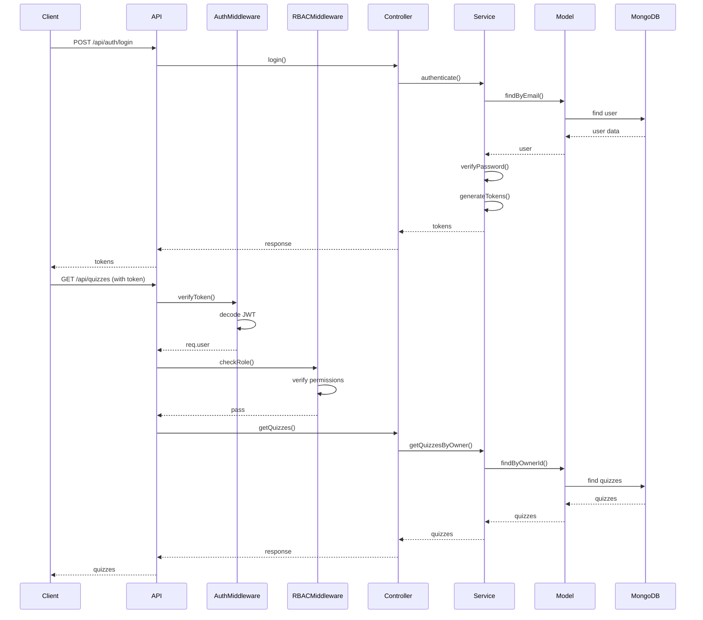
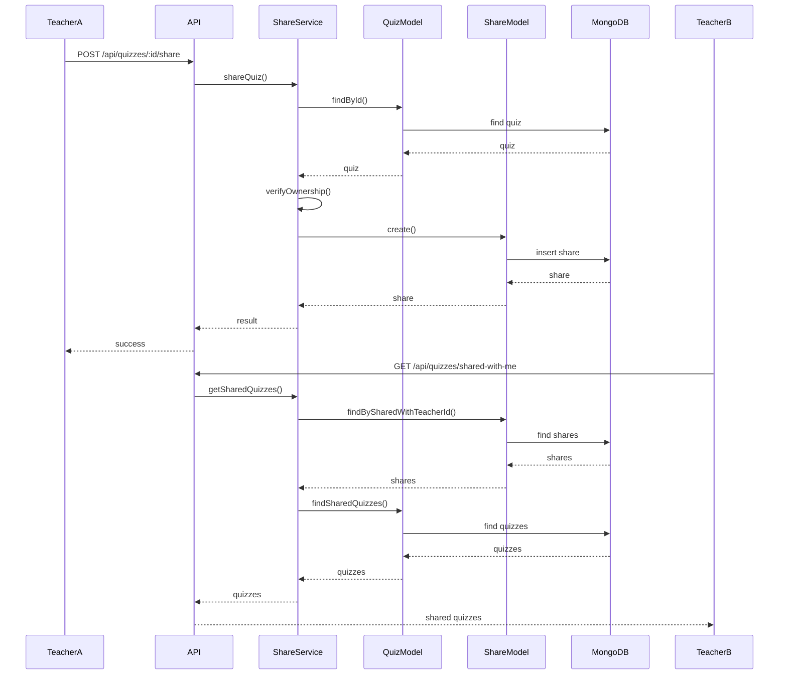

# Arquitetura da API - Sistema de Quizzes

## Diagrama de Arquitetura

```mermaid
graph TB
    subgraph "Frontend (React/Vite)"
        UI[Interface do Usuário]
        API_CLIENT[Cliente HTTP]
    end
    
    subgraph "API Backend (Node.js/Express)"
        subgraph "Camada de Roteamento"
            AUTH_ROUTES[/api/auth]
            USER_ROUTES[/api/users]
            QUIZ_ROUTES[/api/quizzes]
            CLASS_ROUTES[/api/classes]
            ASSIGN_ROUTES[/api/assignments]
            ATTEMPT_ROUTES[/api/attempts]
            SHARE_ROUTES[/api/shares]
        end
        
        subgraph "Camada de Middleware"
            CORS[CORS Middleware]
            AUTH[Auth Middleware]
            RBAC[RBAC Middleware]
            VALID[Validation Middleware]
            ERROR[Error Handler]
        end
        
        subgraph "Camada de Controladores"
            AUTH_CTRL[Auth Controller]
            USER_CTRL[User Controller]
            QUIZ_CTRL[Quiz Controller]
            CLASS_CTRL[Class Controller]
            ASSIGN_CTRL[Assignment Controller]
            ATTEMPT_CTRL[Attempt Controller]
            SHARE_CTRL[Share Controller]
        end
        
        subgraph "Camada de Serviços"
            AUTH_SVC[Auth Service]
            USER_SVC[User Service]
            QUIZ_SVC[Quiz Service]
            CLASS_SVC[Class Service]
            ASSIGN_SVC[Assignment Service]
            ATTEMPT_SVC[Attempt Service]
            SHARE_SVC[Share Service]
        end
        
        subgraph "Camada de Dados (MongoDB/Mongoose)"
            USER_MODEL[User Model]
            CLASS_MODEL[Class Model]
            ENROLL_MODEL[Enrollment Model]
            QUIZ_MODEL[Quiz Model]
            QUESTION_MODEL[QuizQuestion Model]
            ASSIGN_MODEL[QuizAssignment Model]
            ATTEMPT_MODEL[QuizAttempt Model]
            SHARE_MODEL[QuizShare Model]
        end
    end
    
    subgraph "Banco de Dados"
        MONGODB[(MongoDB)]
    end
    
    UI --> API_CLIENT
    API_CLIENT --> AUTH_ROUTES
    API_CLIENT --> USER_ROUTES
    API_CLIENT --> QUIZ_ROUTES
    API_CLIENT --> CLASS_ROUTES
    API_CLIENT --> ASSIGN_ROUTES
    API_CLIENT --> ATTEMPT_ROUTES
    API_CLIENT --> SHARE_ROUTES
    
    AUTH_ROUTES --> CORS
    USER_ROUTES --> CORS
    QUIZ_ROUTES --> CORS
    CLASS_ROUTES --> CORS
    ASSIGN_ROUTES --> CORS
    ATTEMPT_ROUTES --> CORS
    SHARE_ROUTES --> CORS
    
    CORS --> AUTH
    AUTH --> RBAC
    RBAC --> VALID
    VALID --> ERROR
    
    AUTH_ROUTES --> AUTH_CTRL
    USER_ROUTES --> USER_CTRL
    QUIZ_ROUTES --> QUIZ_CTRL
    CLASS_ROUTES --> CLASS_CTRL
    ASSIGN_ROUTES --> ASSIGN_CTRL
    ATTEMPT_ROUTES --> ATTEMPT_CTRL
    SHARE_ROUTES --> SHARE_CTRL
    
    AUTH_CTRL --> AUTH_SVC
    USER_CTRL --> USER_SVC
    QUIZ_CTRL --> QUIZ_SVC
    CLASS_CTRL --> CLASS_SVC
    ASSIGN_CTRL --> ASSIGN_SVC
    ATTEMPT_CTRL --> ATTEMPT_SVC
    SHARE_CTRL --> SHARE_SVC
    
    AUTH_SVC --> USER_MODEL
    USER_SVC --> USER_MODEL
    QUIZ_SVC --> QUIZ_MODEL
    QUIZ_SVC --> QUESTION_MODEL
    QUIZ_SVC --> SHARE_MODEL
    CLASS_SVC --> CLASS_MODEL
    CLASS_SVC --> ENROLL_MODEL
    ASSIGN_SVC --> ASSIGN_MODEL
    ATTEMPT_SVC --> ATTEMPT_MODEL
    SHARE_SVC --> SHARE_MODEL
    
    USER_MODEL --> MONGODB
    CLASS_MODEL --> MONGODB
    ENROLL_MODEL --> MONGODB
    QUIZ_MODEL --> MONGODB
    QUESTION_MODEL --> MONGODB
    ASSIGN_MODEL --> MONGODB
    ATTEMPT_MODEL --> MONGODB
    SHARE_MODEL --> MONGODB
```

## Fluxo de Autenticação e Autorização



## Fluxo de Partilha de Quizzes



## Modelo de Dados

```mermaid
erDiagram
    User {
        ObjectId _id
        string name
        string email
        string passwordHash
        string role
        Date createdAt
        Date updatedAt
    }
    
    Class {
        ObjectId _id
        string name
        string description
        ObjectId teacherId
        Date createdAt
        Date updatedAt
    }
    
    Enrollment {
        ObjectId _id
        ObjectId classId
        ObjectId studentId
    }
    
    Quiz {
        ObjectId _id
        string title
        string description
        ObjectId ownerId
        object metadata
        boolean isPublished
        Date createdAt
        Date updatedAt
    }
    
    QuizQuestion {
        ObjectId _id
        ObjectId quizId
        string type
        string prompt
        object options
        object correctAnswer
        number order
    }
    
    QuizAssignment {
        ObjectId _id
        ObjectId quizId
        ObjectId classId
        ObjectId studentId
        Date availableFrom
        Date availableTo
        boolean isActive
    }
    
    QuizAttempt {
        ObjectId _id
        ObjectId quizId
        ObjectId studentId
        ObjectId assignmentId
        object answers
        number score
        string status
        Date startedAt
        Date submittedAt
    }
    
    QuizShare {
        ObjectId _id
        ObjectId quizId
        ObjectId ownerId
        ObjectId sharedWithTeacherId
        boolean canEdit
        Date createdAt
    }
    
    User ||--o{ Class : creates
    User ||--o{ Quiz : owns
    User ||--o{ QuizShare : shares
    User ||--o{ QuizShare : receives
    Class ||--o{ Enrollment : has
    User ||--o{ Enrollment : enrolled
    Quiz ||--o{ QuizQuestion : contains
    Quiz ||--o{ QuizAssignment : assigned
    Quiz ||--o{ QuizShare : shared
    QuizAssignment ||--o{ QuizAttempt : generates
    User ||--o{ QuizAttempt : submits
```

## Estrutura de Pastas Detalhada

```
api_angela_ai/
├── src/
│   ├── config/                 # Configurações da aplicação
│   │   ├── db.ts               # Configuração da conexão MongoDB
│   │   └── env.ts              # Variáveis de ambiente
│   ├── middleware/             # Middleware Express
│   │   ├── auth.ts             # Middleware de autenticação JWT
│   │   ├── rbac.ts             # Middleware de controle de acesso
│   │   ├── errorHandler.ts     # Middleware de tratamento de erros
│   │   └── validation.ts       # Middleware de validação
│   ├── models/                 # Modelos Mongoose
│   │   ├── user.model.ts       # Modelo de Usuário
│   │   ├── class.model.ts      # Modelo de Turma/Curso
│   │   ├── enrollment.model.ts # Modelo de Matrícula
│   │   ├── quiz.model.ts       # Modelo de Quiz
│   │   ├── quizQuestion.model.ts # Modelo de Questão
│   │   ├── quizAssignment.model.ts # Modelo de Assignment
│   │   ├── quizAttempt.model.ts # Modelo de Tentativa
│   │   └── quizShare.model.ts  # Modelo de Partilha
│   ├── modules/                # Módulos de funcionalidades
│   │   ├── auth/               # Módulo de autenticação
│   │   │   ├── auth.controller.ts
│   │   │   ├── auth.routes.ts
│   │   │   └── auth.service.ts
│   │   ├── users/              # Módulo de usuários
│   │   │   ├── user.controller.ts
│   │   │   ├── user.routes.ts
│   │   │   └── user.service.ts
│   │   ├── classes/            # Módulo de turmas/cursos
│   │   │   ├── class.controller.ts
│   │   │   ├── class.routes.ts
│   │   │   └── class.service.ts
│   │   ├── quizzes/            # Módulo de quizzes
│   │   │   ├── quiz.controller.ts
│   │   │   ├── quiz.routes.ts
│   │   │   └── quiz.service.ts
│   │   ├── assignments/        # Módulo de assignments
│   │   │   ├── assignment.controller.ts
│   │   │   ├── assignment.routes.ts
│   │   │   └── assignment.service.ts
│   │   ├── attempts/           # Módulo de tentativas
│   │   │   ├── attempt.controller.ts
│   │   │   ├── attempt.routes.ts
│   │   │   └── attempt.service.ts
│   │   └── shares/             # Módulo de partilha
│   │       ├── share.controller.ts
│   │       ├── share.routes.ts
│   │       └── share.service.ts
│   ├── types/                  # Tipos TypeScript
│   │   └── index.ts            # Tipos compartilhados
│   ├── utils/                  # Utilitários
│   │   ├── jwt.ts              # Funções JWT
│   │   ├── password.ts         # Funções de password
│   │   └── validation.ts       # Funções de validação
│   └── server.ts               # Arquivo principal do servidor
├── tests/                      # Testes
│   ├── unit/                   # Testes unitários
│   ├── integration/            # Testes de integração
│   └── setup.ts                # Configuração de testes
├── .env.example                # Exemplo de variáveis de ambiente
├── .gitignore                  # Arquivos ignorados pelo Git
├── jest.config.js              # Configuração do Jest
├── package.json                # Dependências e scripts
├── pnpm-lock.yaml              # Lock file do pnpm
├── tsconfig.json               # Configuração do TypeScript
└── README.md                   # Documentação do projeto
```

## Padrões Arquiteturais

### 1. Arquitetura em Camadas
- **Camada de Apresentação**: Controllers e Rotas
- **Camada de Lógica de Negócio**: Services
- **Camada de Acesso a Dados**: Models Mongoose
- **Camada de Infraestrutura**: Configurações e Middleware

### 2. Padrão de Injeção de Dependências
- Services recebem models como dependências
- Controllers recebem services como dependências
- Facilita testabilidade e desacoplamento

### 3. Padrão de Repository (implícito)
- Models Mongoose atuam como repositories
- Abstração do acesso a dados
- Centralização de queries

### 4. Padrão de Middleware
- Middleware para preocupações transversais
- Autenticação, autorização, validação, logging
- Reutilização e separação de responsabilidades

### 5. Padrão de DTO (Data Transfer Object)
- Validação de inputs com Zod
- Transformação de dados
- Separação entre camadas

## Considerações de Escalabilidade

### 1. Escalabilidade Horizontal
- API stateless (exceto para JWT)
- Facilidade de deploy em múltiplas instâncias
- Balanceamento de carga

### 2. Performance
- Índices adequados no MongoDB
- Queries otimizadas
- Rate limiting para prevenir abusos

### 3. Monitoramento
- Logging estruturado
- Métricas de performance
- Health checks

### 4. Segurança
- Autenticação robusta com JWT
- Autorização granular com RBAC
- Validação de inputs
- Proteção contra ataques comuns

Esta arquitetura fornece uma base sólida, escalável e mantível para o sistema de quizzes, seguindo as melhores práticas do ecossistema Node.js/TypeScript.